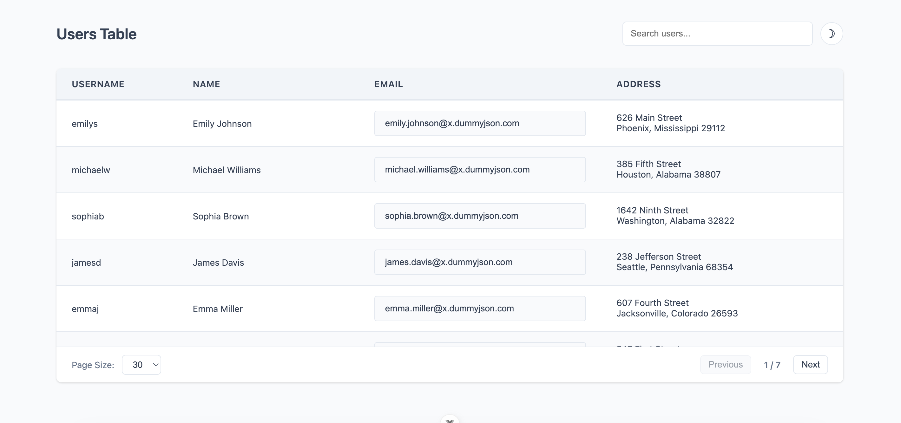
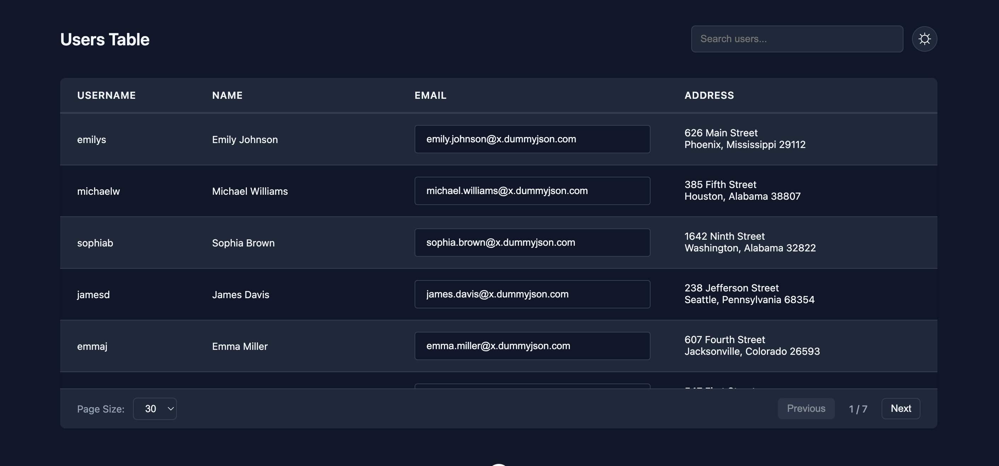

# User Table Application
A Vue.js 3 application displaying a paginated, sortable, and searchable user table with dark mode support.

## Features
-   **Sorting**: Sort users by Username, Name, Email, or Address. Click headers to toggle ascending/descending.
-   **Search**: Real-time filtering by any field (debounced 300ms).
-   **Pagination**: Server-side pagination with adjustable page sizes (5, 10, 20, 30, 40, 50).
-   **Zebra Striping**: Even rows have a subtle background color for improved readability.
-   **Address Formatting**: Address details are formatted on two lines (Street / City, State Zip).
-   **Toggle**: Switch between Light and Dark themes using the sun/moon button in the header.

## Project Setup

```sh
npm install
npm run dev
```

## Screenshot

